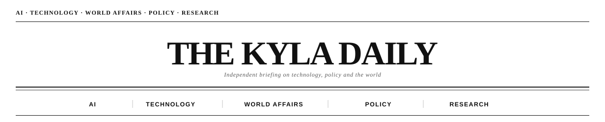
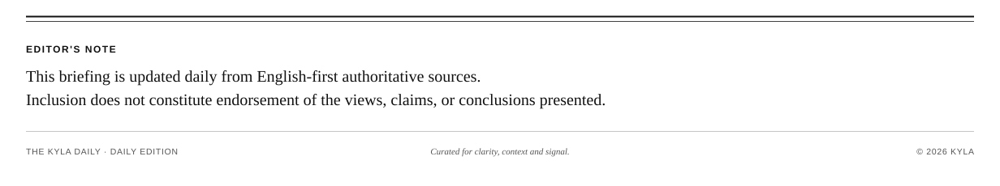

<h1 align="center">Hi 👋, I'm Kyla</h1>
<h3 align="center">Building auditable AI systems: agents, workflow verification, and product infrastructure.</h3>

AI Engineer · Cornell Tech Research Assistant · Open-source Author

  

<!-- Daily Briefing:START -->

  
   
  Vol. 007 - Saturday, September 5, 2026
  

<table align="center" width="88%">
  <tr>
    <td width="50%"><strong>Astra shifts from advantage to platform</strong>  Thibault Sottiaux says early internal access to Astra accelerated OpenAI's roadmap enough to pull work forward by months. Now that the model is broadly available, the competitive question moves from who has the model to who can operationalize it fastest.  Source: <a href="https://x.com/thsottiaux/status/2096101429832552872">Thibault Sottiaux</a></td>
    <td width="50%"><strong>Astra reaches paid builders</strong>  Sam Altman says GPT-6 Astra is now available to Pro, Enterprise and Business Premium users in Work/Codex and in the API, with Plus and Business rollout following. Access policy is becoming part of the launch narrative for frontier models.  Source: <a href="https://x.com/sama/status/2095973658867171733">Sam Altman</a></td>
  </tr>
  <tr>
    <td width="50%"><strong>Web pages may expose tools to agents</strong>  Guillermo Rauch points to WebMCP as a way for the existing web to present page-specific debugging and interaction tools directly to agents. For builders, the browser becomes less of a black box and more of an agent-aware runtime surface.  Source: <a href="https://x.com/rauchg/status/2096065378598441431">Guillermo Rauch</a></td>
    <td width="50%"><strong>Agent browsers become integration harnesses</strong>  Garry Tan describes using AsideAI as a remote browser harness with credentials, integrations, browser control and memory. The pattern matters because useful agents often need authenticated web access, not just local files and isolated tools.  Source: <a href="https://x.com/garrytan/status/2095948689823121872">Garry Tan</a></td>
  </tr>
  <tr>
    <td colspan="2"><strong>Chip architecture returns to the AI center</strong>  No Priors' interview with Arm CEO Rene Haas connects AI demand to CPU orchestration, verification, supply chains and the move from IP licensing toward physical products. The hardware story is not just GPUs: deployment depends on the wider compute system around them.  Source: <a href="https://www.youtube.com/@NoPriorsPodcast">No Priors</a></td>
  </tr>
</table>

  

<!-- Daily Briefing:END -->

<h3 align="left">Connect with me</h3>

  

<h3 align="left">Languages and Tools</h3>

  

<h3 align="left">GitHub Stats</h3>

  
  

