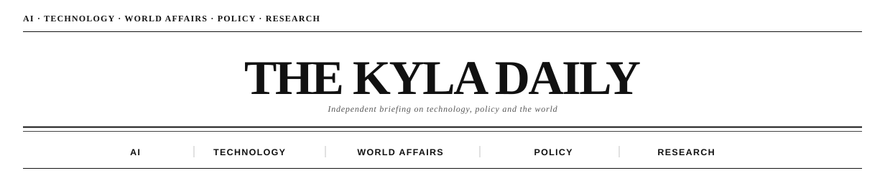
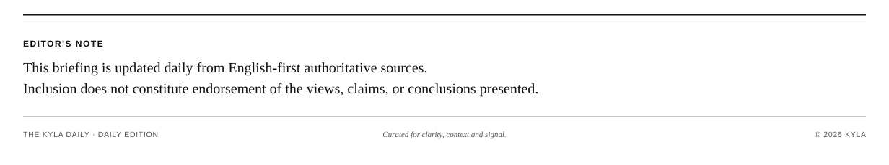

<h1 align="center">Hi 👋, I'm Kyla</h1>
<h3 align="center">Building auditable AI systems: agents, workflow verification, and product infrastructure.</h3>

AI Engineer · Cornell Tech Research Assistant · Open-source Author

  

<!-- Daily Briefing:START -->

  
   
  Vol. 039 - Wednesday, October 7, 2026
  

<table align="center" width="88%">
  <tr>
    <td width="50%"><strong>Prompt engineering contracts to three instructions</strong>  Boris Cherny says capable models need less elaborate scaffolding than earlier generations. For most work, a useful prompt now communicates the goal, the desired effort and how success should be verified, shifting skill from incantation toward clear delegation and measurable completion.  Source: <a href="https://x.com/bcherny/status/2107565388250874193">Boris Cherny</a></td>
    <td width="50%"><strong>AI reverse engineering tests software secrecy</strong>  Amjad Masad predicts that stronger decompilation and reverse-engineering systems could make proprietary software increasingly transparent in practice. If models can reconstruct behavior and structure from binaries, competitive advantage may move away from code possession toward data, distribution, operations and iteration speed.  Source: <a href="https://x.com/amasad/status/2107671204639465961">Amjad Masad</a></td>
  </tr>
  <tr>
    <td width="50%"><strong>Cybersecurity prepares for agents on both sides</strong>  Aaron Levie expects security teams to face more vulnerable generated code, autonomous attacks and accidental agent swarms searching for data. The same technology will also power defenders, creating demand for agent-based protection across software, infrastructure and enterprise information.  Source: <a href="https://x.com/levie/status/2107680435644039269">Aaron Levie</a></td>
    <td width="50%"><strong>Singapore puts financial AI under lifecycle controls</strong>  The Monetary Authority of Singapore issued risk-management guidelines covering every financial institution and form of AI. Firms must maintain accountable oversight, inventory material uses, test and monitor systems, manage third-party providers and scale controls to risk, with implementation beginning in October 2027.  Source: <a href="https://www.mas.gov.sg/news/media-releases/2026/mas-sets-out-supervisory-expectations-on-responsible-ai-adoption-by-financial-institutions">Monetary Authority of Singapore</a></td>
  </tr>
  <tr>
    <td colspan="2"><strong>Nuclear clocks begin to tick</strong>  Two teams report the first implementations of clocks based on transitions inside atomic nuclei rather than electron energy levels. The systems point toward a new standard for precision timekeeping and could help researchers probe fundamental physics, including possible signatures of dark matter.  Source: <a href="https://www.nature.com/articles/d41586-026-03060-9">Nature</a></td>
  </tr>
</table>

  

<!-- Daily Briefing:END -->

<h3 align="left">Connect with me</h3>

  

<h3 align="left">Languages and Tools</h3>

  

<h3 align="left">GitHub Stats</h3>

  
  

